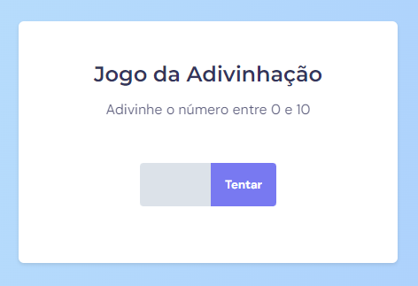

<h1 align="center"> Jogo adivinhação </h1>

## Projeto

Este projeto foi desenvolvido para aplicar habilidades em JavaScript, HTML e CSS, resultando em uma aplicação para adivinhar um número randômico. 

  

## Tecnologias
- HTML
- CSS
- JavaScript

Projeto criado a partir de um desafio do nível 5 do Explorer da Rocketseat.